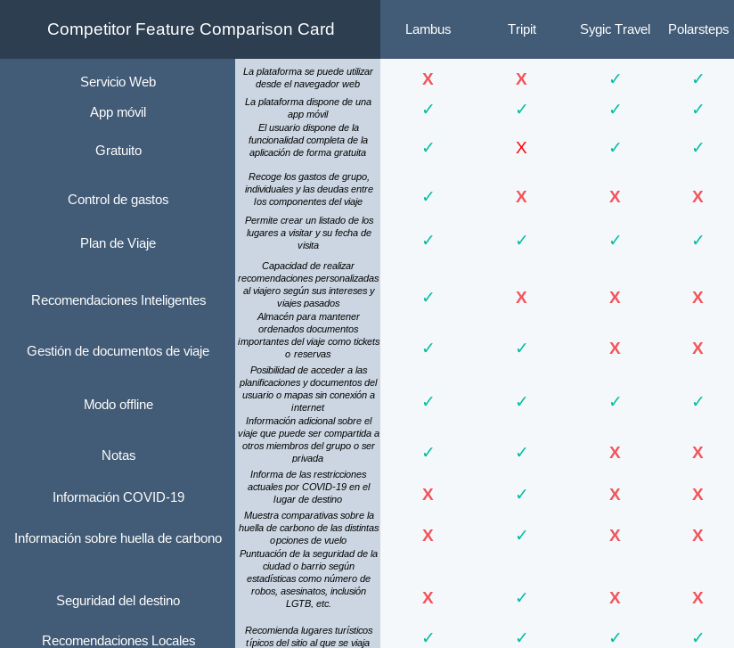
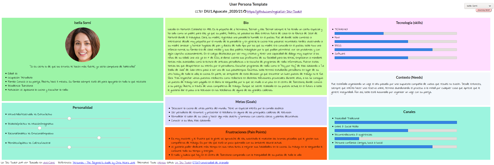
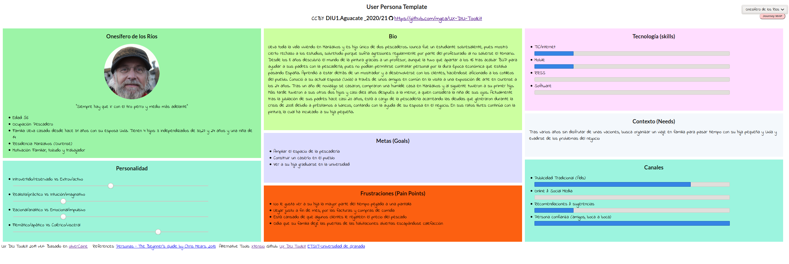

# DIU1_Aguacate - Practica1, entregables.

## 1. Análisis de Competencia
- [Lambus](https://www.lambus.com): Se trata de una aplicación móvil para la organización de viajes que no dispone de versión de escritorio. En el análisis de la competencia ha demostrado disponer de las mismas o más funcionalidades que el resto de sus competidores aún no disponiendo de algunas comodidades que otros sí ofrecen como información COVID del destino. Se anuncian en su página web como la “Plataforma de viajes todo-en-uno”.
- [Tripit](https://www.tripit.com/web): Es una aplicación para móvil de organización de viajes que se anuncian a ellos mismos como la mejor valorada de la Playstore. No obstante la aplicación no presenta algunos de los servicios que pueden ser vistos en otras aplicaciones de este tipo, como servicio de control de gatos, o aprender de las búsquedas del usuario para adaptar sus gustos a las recomendaciones de viajes. Aún así ofrece una planificación del itinerario del viaje muy completa, teniendo la posibilidad de de añadir notas u obtener información sobre restricciones de COVID-19 en la zona, así como gestionar la documentación del viaje.
- [Sygic Travel](https://www.sygic.com/es/travel): Estamos ante una aplicación de planificación de viajes definida en su página web como un planificador muy potente con mapas muy detallados. Presenta funcionalidades como la planificación del viaje añadiendo paradas y recomendaciones sobre el sitio a visitar. Además, ofrece sus servicios de manera offline. No obstante, son pocos los servicios que ofrece ya que no se puede llevar un control de gastos o llevar una gestión de los documentos del viaje entre otros servicios que sí hemos visto en otras de las aplicaciones analizadas.
- [Polarsteps](https://www.polarsteps.com/): Esta aplicación móvil de gestión de viajes presenta una apariencia muy cuidada y atractiva con el uso de grandes imágenes de destinos turísticos que llaman la atención pero no consigue ofrecer un catálogo de funcionalidades mejor que el resto de sus competidores.

Hemos elegido Lambus por sus buenas reviews en Google Play Store, además de su cuidada presentación y amplio catálogo de funcionalidades en comparación con sus competidores seleccionados. 

## 2. Personas
En primer lugar tenemos a Isella. Isella es una joven periodista apasionada por el periodismo y la cocina desde muy pequeña. Actualmente trabaja en el diario la Vanguardia, en Barcelona, ciudad donde ella ahora vive. Isella se caracteriza por ser una persona creativa, muy de letras y por ser un tanto inocente.

Para la segunda persona hemos creado a Onesífero de los Ríos, un hombre humilde con una pequeña pescadería, que lleva toda la vida viviendo en el mismo pueblo, Manzalvos. Onesífero se caracteriza por su carácter trabajador y tozudo, aunque esto último no tanto cuando se trata de su hija pequeña.  

## 3. Journey Maps
Hemos querido representar el uso de la aplicación por parte de las dos personas diseñadas teniendo en cuenta el reto que cada una presenta.

## 4. Revisión de Usabilidad
Estamos ante una aplicación visualmente atractiva, pero con problemas en la organización del contenido y carencias en la orientación al usuario.
