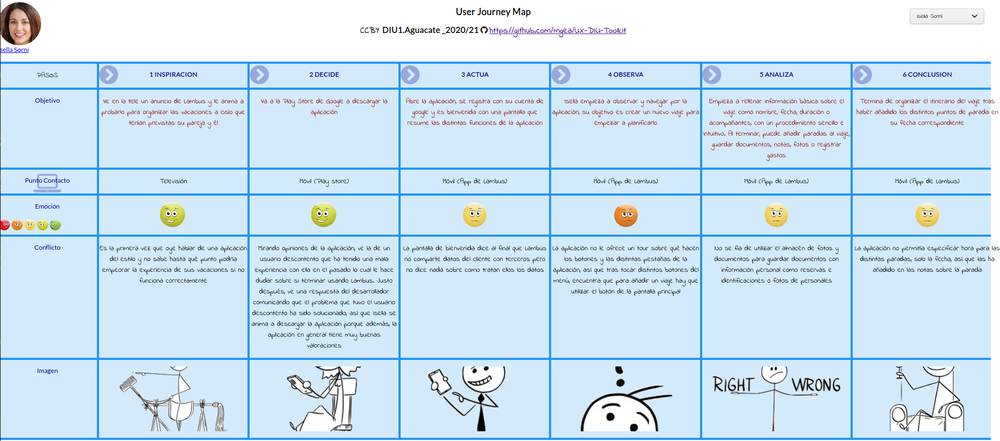

# DIU1_Aguacate - Practica1, entregables.

## 1. Análisis de Competencia
- [Lambus](https://www.lambus.com): Se trata de una aplicación móvil para la organización de viajes que no dispone de versión de escritorio. En el análisis de la competencia ha demostrado disponer de las mismas o más funcionalidades que el resto de sus competidores aún no disponiendo de algunas comodidades que otros sí ofrecen como información COVID del destino. Se anuncian en su página web como la “Plataforma de viajes todo-en-uno”.
- [Tripit](https://www.tripit.com/web): Es una aplicación para móvil de organización de viajes que se anuncian a ellos mismos como la mejor valorada de la Playstore. No obstante la aplicación no presenta algunos de los servicios que pueden ser vistos en otras aplicaciones de este tipo, como servicio de control de gatos, o aprender de las búsquedas del usuario para adaptar sus gustos a las recomendaciones de viajes. Aún así ofrece una planificación del itinerario del viaje muy completa, teniendo la posibilidad de de añadir notas u obtener información sobre restricciones de COVID-19 en la zona, así como gestionar la documentación del viaje.
- [Sygic Travel](https://www.sygic.com/es/travel): Estamos ante una aplicación de planificación de viajes definida en su página web como un planificador muy potente con mapas muy detallados. Presenta funcionalidades como la planificación del viaje añadiendo paradas y recomendaciones sobre el sitio a visitar. Además, ofrece sus servicios de manera offline. No obstante, son pocos los servicios que ofrece ya que no se puede llevar un control de gastos o llevar una gestión de los documentos del viaje entre otros servicios que sí hemos visto en otras de las aplicaciones analizadas.
- [Polarsteps](https://www.polarsteps.com/): Esta aplicación móvil de gestión de viajes presenta una apariencia muy cuidada y atractiva con el uso de grandes imágenes de destinos turísticos que llaman la atención pero no consigue ofrecer un catálogo de funcionalidades mejor que el resto de sus competidores.

Hemos elegido Lambus por sus buenas reviews en Google Play Store, además de su cuidada presentación y amplio catálogo de funcionalidades en comparación con sus competidores seleccionados. 

## 2. Personas
En primer lugar tenemos a Isella. Isella es una joven periodista apasionada por el periodismo y la cocina desde muy pequeña. Actualmente trabaja en el diario la Vanguardia, en Barcelona, ciudad donde ella ahora vive. Isella se caracteriza por ser una persona creativa, muy de letras y por ser un tanto inocente.

Para la segunda persona hemos creado a Onesífero de los Ríos, un hombre humilde con una pequeña pescadería, que lleva toda la vida viviendo en el mismo pueblo, Manzalvos. Onesífero se caracteriza por su carácter trabajador y tozudo, aunque esto último no tanto cuando se trata de su hija pequeña.  

## 3. Journey Maps
Isella quiere tener el control total sobre el viaje que va a planificar pero, durante el uso de la aplicación, termina algo decepcionada debido a que Lambus no ofrece algo que ella considera tan básico como poder definir unas horas concretas para las distintas paradas de su viaje. Además, le ha resultado algo difícil navegar por los distintos menús de la app.

 
Onesífero desde el principio se muestra dubitativo ante el uso de una aplicación móvil para la planificación de su viaje, pero acaba cediendo ante su hija quien considera que la mejor alternativa es la utilización de una aplicación móvil con buena puntuación en Internet, pero ante su posterior decepción tras sentirse perdido en todo el proceso de la planificación del viaje concluye que hubiera sido mejor utilizar un medio más tradicional como una agencia de viajes.

## 4. Revisión de Usabilidad
 - Valoración final: 65
 - Comentario sobre la valoración: En general, Lambus ha demostrado ser una app que mayormente cumple con la funcionalidad básica que puede esperar un viajero pero que se ve lastrada por el uso de unos menús poco señalizados por los que es fácil perderse.

Lambus destaca positivamente por los siguientes aspectos:
- Colocar a la vista y fácilmente accesibles los accesos a los menús de tareas de uso frecuente desde el menú principal de la app.
- La funcionalidad y características que aporta la aplicación satisfacen en su mayoría las necesidades de un viajero.
- La página de inicio es clara y no está sobrecargada de elementos.
- La aplicación es fácil de conseguir a través de la Play Store o la App Store.
- Se utilizan los campos de entrada apropiados (como calendarios, teclados numéricos...) para la introducción de la información en los formularios
- El texto es fácilmente legible y presenta un buen contraste.
- La aplicación se adapta a distintas configuraciones de smartphone como distintas resoluciones, o versiones de SO.

A pesar de estas caracterísitcas Lambus presenta algunas desventajas:
- No ofrece tutoriales/tours de la aplicación a aquellos usuarios con poco nivel de experiencia en aplicaciones móviles.
- No indica al usuario en qué parte de la aplicación se encuentra.
- Dispone de opción de búsqueda sólo en algunas de sus funcionalidades.
- No es posible hacer modificaciones o volver atrás sobre cambios que haya realizado el usuario, ni tampoco informa del éxito o error de los cambios realizados.
- No dispone de campos opcionales en el proceso de creación del viaje.
- No se informa de los errores de la aplicación y cuando se informa no se explica el por qué del error.
- No ofrece enlaces externos a la aplicación.
- Para acceder a la ayuda ofrecida por la aplicación, el progreso de un trabajo del usuario es borrado por completo, es decir, no lo puede reanudar.
