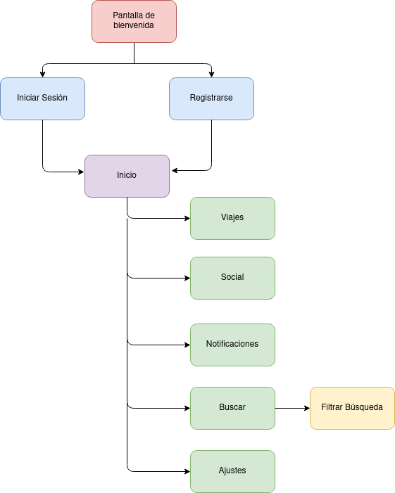

## DIU - Practica2, entregables

### Ideación 
* Mapa de empatía

### PROPUESTA DE VALOR
* ScopeCanvas
Se quiere desarrollar una aplicación móvil para la gestión y planificación de viajes. Esta aplicación permitirá al usuario si así lo desea, organizar su viaje hasta el más mínimo detalle, desde especificar horas concretas para paradas del viaje hasta poder hacer futuras reservas en establecimientos dentro de la propia app. El objetivo principal es hacer que el usuario tenga todo lo que necesite para organizar su viaje en una misma aplicación.

La aplicación implementará las siguientes funcionalidades:
* Guardar documentación del viaje (billetes de avión, entradas a museos…).
* Localización del usuario en tiempo real.
* Informar sobre las restricciones de COVID-19 en el lugar a visitar.
* Recomendar en función de las preferencias del usuario a partir de unos filtros
* Creación de un viaje en el que se añaden la lista de sitios a visitar con su fecha e intervalo de hora.
* Crear grupos con las personas con las que el usuario va a viajar para la compartición de un viaje.
* Reserva de hoteles/hostales
* Comprar entradas a museos o parques de atracciones.
* Un modo oscuro
* Galería de fotos

### TASK ANALYSIS

* User Task Matrix 

| GRUPO DE USUARIOS                       | Usuario invitado | Usuario planificando viaje | Usuario durante su viaje | Usuario tras su viaje |
|-----------------------------------------|------------------|----------------------------|--------------------------|-----------------------|
| Crear un viaje                          | -                | M                          | L                        | L                     |
| Añadir una parada                       | -                | H                          | M                        | L                     |
| Eliminar una parada                     | -                | H                          | M                        | L                     |
| Editar parada                           | -                | H                          | H                        | L                     |
| Consultar un viaje                      | -                | H                          | H                        | M                     |
| Eliminar un viaje                       | -                | L                          | L                        | H                     |
| Añadir documentación                    | -                | H                          | L                        | L                     |
| Buscar lugares turísticos               | M                | H                          | M                        | L                     |
| Reservar hotel                          | -                | M                          | L                        | L                     |
| Consultar notificaciones                | -                | M                          | H                        | L                     |
| Añadir amigo                            | -                | L                          | M                        | L                     |
| Crear grupo                             | -                | M                          | L                        | L                     |
| Añadir miembro al grupo                 | -                | L                          | M                        | L                     |
| Eliminar grupo                          | -                | L                          | L                        | H                     |
| Salir del grupo                         | -                | L                          | L                        | H                     |
| Enviar mensaje                          | -                | M                          | M                        | L                     |
| Buscar hospedaje                        | M                | H                          | L                        | L                     |
| Iniciar Sesión                          | M                | L                          | L                        | L                     |
| Registrarse                             | H                | L                          | L                        | L                     |
| Consultar restricciones COVID-19        | H                | H                          | H                        | L                     |
| Consultar chat de grupo                 | -                | M                          | M                        | L                     |
| Consultar chat con usuario              | -                | M                          | M                        | L                     |
| Consultar mapa                          | H                | H                          | H                        | L                     |
| Compartir información del viaje en RRSS | -                | M                          | H                        | H                     |

### ARQUITECTURA DE INFORMACIÓN

* Sitemap 

* Labelling 

| Término                | Icono | Significado                                                                                                                                                         |
|------------------------|-------|---------------------------------------------------------------------------------------------------------------------------------------------------------------------|
| Iniciar Sesión         |       | Se inicia sesión en la aplicación.                                                                                                                                  |
| Registrarse            |       | Se accede a la opción de registro en la aplicación.                                                                                                                 |
| Inicio                 |       | Se accede a la página de inicio de la aplicación, donde se muestran el listado de viajes del usuario.                                                               |
| Buscar                 |       | Se accede a la opción de búsqueda de la aplicación para buscar hoteles y lugares que visitar además de apartados de la aplicación.                                  |
| Notificaciones         |       | Se acceden a las notificaciones del usuario (nuevos mensajes,solicitudes de amistad, cancelaciones de reservas, retrasos, cambios de restricciones COVID-19...).    |
| Social                 |       | Se accede a los chats con otros usuarios de la aplicación.                                                                                                          |
| Ajustes                |       | Configuración de la aplicación y del perfil del usuario (editar nombre de usuario, cambiar de contraseña, cambiar a modo nocturno/diurno, cambiar foto de perfil…). |
| Filtrar búsqueda       |       | En la opción de buscar se permitirá filtrar la búsqueda del usuario (filtro de popularidad, filtro de sólo restaurantes, sólo hoteles…).                            |
| Información legal      |       | Políticas de privacidad y uso de la aplicación.                                                                                                                     |
| Centro de ayuda        |       | El usuario puede resolver sus dudas en un FAQ o Chat Online.                                                                                                        |
| Chat online            |       | Se abrirá un chat con una IA para responder dudas.                                                                                                                  |
| FAQ                    |       | Listado de preguntas comunes que se suelen realizar sobre el uso de la aplicación.                                                                                  |
| Idiomas                |       | Selección de idioma de la aplicación.                                                                                                                               |
| Tema                   |       | Selección entre un listado de temas para usar en la aplicación.                                                                                                     |
| Unidades de medida     |       | El usuario podrá seleccionar la moneda, así como las unidades de distancia utilizadas.                                                                              |
| Gastos                 |       | Listado de los gastos que va introduciendo el usuario durante la planificación y desarrollo del viaje.                                                              |
| Restricciones COVID-19 |       | Listado de las restricciones COVID-19 en el lugar a visitar por el usuario.                                                                                         |
| Compartir              |       | Compartir paradas, rutas y fotografías.                                                                                                                             |
| Reservas               |       | Listado de reservas de hoteles/restaurantes del usuario.                                                                                                            |
| Documentación          |       | Sección donde guardar toda la documentación relacionada con el viaje (billetes de vuelo, tren, entradas a museos…).                                                 |
| Paradas                |       | Mapa con las paradas a visitar del viaje del usuario.                                                                                                               |
| Añadir amigo           |       | Añadir un amigo a la lista de amigos del usuario introduciendo su nombre de usuario.                                                                                |
| Eliminar amigo         |       | Eliminar un amigo de la lista de amigos del usuario.                                                                                                                |

                                                                                                              

### Prototipo Lo-FI Wireframe 

### Conclusiones  
En esta práctica hemos sentado las bases de lo que será nuestro proyecto, hemos
conseguido identificar cual será la funcionalidad de nuestra aplicación además de
la razón de existir de esta.

También hemos podido organizar y distribuir las distintas secciones de la aplicación
mediante el sitemap, facilitándonos conseguir una estructura de contenidos y menús
ordenada.

Por último, el uso de herramientas de prototipado y diseño de GUI como Adobe Xd nos
ha introducido al uso de este tipo de aplicaciones de diseño.
