# DIU - Practica 3, entregables

## Moodboard (diseño visual + logotipo)
Al empezar a idear nuestra aplicación, buscábamos dar una imagen moderna, minimalista y que resultara amigable al usuario. Esto se ha tenido en cuenta a la hora de escoger los colores, fuentes y en general, para tomar decisiones respecto a las guidelines de la que será nuestra aplicación.

### Nombre de la aplicación
El nombre a utilizar no fue muy difícil de elegir realmente. El nombre “Lolis” surgió como una broma interna que con el tiempo se derivó del nombre “Lola”. Como nos gustaba el nombre y no nos recordaba a ninguna otra cosa, decidimos bautizar así a la aplicación.

### Eslogan
Cuando pensamos en un eslogan, queríamos dar una impresión de calidez y cercanía a la vez que dar una idea brevemente al receptor de la temática de la aplicación. Algunos candidatos que se estuvieron barajando fueron:
- All you need is love your passport.
- No necesitas suerte, necesitas moverte.
- Colecciona momentos no cosas.
- Somos cómplices de tu aventura.

Una vez teníamos estos candidatos pensamos, ¿Qué mejor forma para elegir el mejor eslogan que simplemente diciéndolo en voz alta? Así que simplemente nos reunimos en llamada a leerlos en voz alta hasta que tomamos una decisión.

Los candidatos que más consiguieron a nuestro parecer esa impresión que buscábamos fueron “Somos cómplices de tu aventura.” y el último que elegimos, “Tu mejor plan empieza con nosotros.”. Al final, nos terminamos decantando por el segundo, en gran parte debido a que ese uso de la palabra “nosotros” nos parecía que podía sonar más cercano y familiar al cliente.

### Fotografías inspiradoras
Con las fotografías inspiradoras escogidas queríamos captar la esencia de lo que implica un viaje y plasmar esto en nuestra aplicación a través de los colores, iconos e imágenes de la aplicación. 

Para obtener las imágenes, decidimos utilizar esta herramienta https://labs.tineye.com/multicolr/ la cual nos permite buscar fotografías de Flickr seleccionando una paleta de hasta 5 colores y una serie de tags para filtrar la búsqueda por temática.

Terminamos escogiendo tres imágenes de destinos muy distintos entre sí: tropical, urbano y rural.

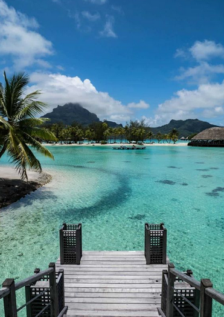
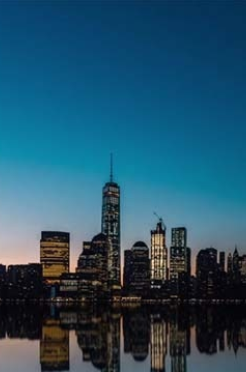
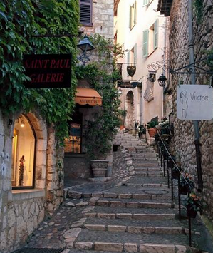

### Paleta de colores
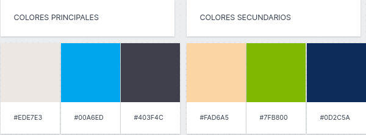 
Al comienzo del diseño de la paleta de colores buscábamos colores divertidos y coloridos, pero terminamos concluyendo que menos es más, pues no queríamos realizar un diseño muy sobrecargado.

A raíz de las fotografías inspiradoras, entramos a https://coolors.co/ para decidir nuestra paleta de colores y acabamos escogiendo tres colores principales y tres secundarios que recuerdan tanto a un pueblo con colores como el verde del campo o el beige de las paredes de yeso, como a una ciudad con colores nocturnos (negro y azul marino), así como a una playa haciendo uso de colores azulados o narajas que recordaran a la arena o a un atardecer. 

Con estos colores también buscábamos hacer contrastes para destacar los elementos más importantes de la aplicación y el diseño de un tema claro y nocturno, siempre teniendo en cuenta que la combinación de los colores no estuviera muy saturada. En el diseño del modo nocturno probamos el azul marino como fondo, pero no nos resultó cómodo a la vista, así que optamos por el negro que nos pareció una opción mucho mejor y más elegante que la primera. 
 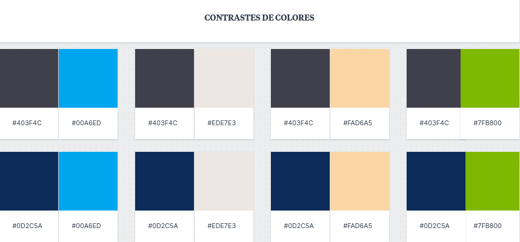

### Logotipo
 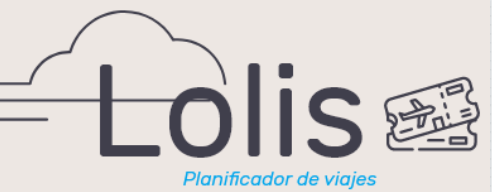 
El logotipo, al ser la imagen principal de la aplicación y de nuestra compañía, queríamos que reflejase esas características mencionadas anteriormente de minimalismo, modernidad y cercanía.

Con estas ideas en mente, utilizamos Adobe Xd en conjunto con el plugin de unDraw (catálogo de gran tamaño de dibujos vectorizados) para diseñar nuestro logo.

En el resultado final, conseguimos ese minimalismo utilizando la tipografía Rubik regular, que con sus simples trazos encaja perfectamente en lo que buscábamos. Además, se añadió una nube y unos tickets de avión vectorizados con un bajo número de líneas para impulsar esa idea de simplicidad, además de apoyar al subtítulo inferior para dar un incentivo visual fácilmente reconocible sobre lo que trata la aplicación.

### Tipografías
 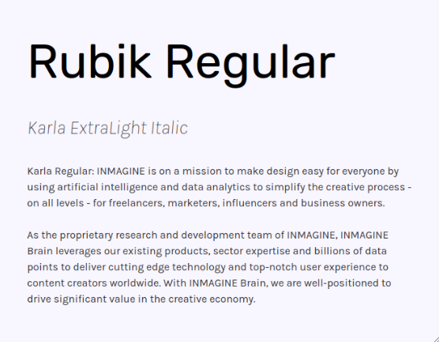 
A la hora de elegir las tipografías a utilizar, teníamos en mente principalmente legibilidad, simplicidad y accesibilidad. Es por esto último que hemos querido investigar sobre distintos posibles problemas de accesibilidad que pudiera presentar el usuario. Finalmente, siguiendo los consejos de este [estudio](https://reciteme.com/uploads/articles/accessible_fonts_guide.pdf), hemos decidido incluir en nuestras guidelines el uso de dos fuentes alternativas para intentar facilitar el uso de la aplicación a usuarios con problemas de dislexia o de visibilidad en general. Para lo primero utilizaremos la fuente OpenDyslexic la cual, da más peso a la parte inferior de la letra para intentar combatir esa sensación de movimiento de los caracteres que en ocasiones experimentan estos usuarios mientras que para lo segundo, se ha optado por la tipografía “Fs Me” que intenta llevar la legibilidad un paso más allá destacando cosas como los puntos sobre las ‘i’ y ‘j’.

Las dos tipografías principales que se usarán por defecto serán Rubik y Karla. En primer lugar, Rubik es una fuente muy sencilla, legible, redondeada y ampliamente disponible en la gran mayoría de dispositivos actuales. Sus trazos redondeados pensamos que encajan no solo con la imagen que queremos presentar sino que también con las tendencias de diseño actuales, las cuales utilizan unas líneas más suaves y redondeadas. Respecto a los tamaños en los que se mostrará, utilizaremos 40pt para títulos principales y 25pt para títulos secundarios.

Un tercer tipo de título más pequeño se mostrará en Karla ExtraLight Italic 12pt. Por último, el texto normal se mostrará en Karla 12pt. Elegimos Karla por ser una fuente moderna, sans serif y fácil de leer.

### Herramientas utilizadas en el Moodboard

Además de las diferentes páginas mencionadas anteriormente, estas dos aplicaciones fueron a las que más tiempo dedicamos:

La aplicación de Milanote nos llamó la atención desde que la usamos en clase de teoría por su facilidad de uso, sencillez y su facilidad para trabajar en equipo en un mismo tablón. Es por esto que decidimos utilizarla para inspirarnos y plasmar el estilo visual que queríamos para nuestro proyecto.
 

Además, se usó Adobe Xd para la creación del logotipo y las muestras de los temas claro y oscuro de nuestra aplicación.

## Landing Page
Con el lading page queríamos que el usuario con un solo vistazo tenga una idea general sobre los servicios de nuestra aplicación y qué nos diferencia y hace mejor de nuestros competidores (compartir gastos y organizar documentos de viaje), además de incentivar al visitante a descargar nuestra aplicación. 

También queríamos transmitir el diseño minimalista de la aplicación con el uso de contrastes de colores e imaǵenes planas tal y como se ha planteado en el moodboard anteriormente. Acompañamos la Lading Page con nuestro eslogan y una serie de imágenes que irán apareciendo a modo de carrusel dentro del mockup del iPhone 12 que aparece a la derecha. Estas imágenes serán muestras de la interfaz y la funcionalidad principal que presenta la aplicación con el objetivo de servir como refuerzo visual para animar al usuario a probarla.

Realizar el diseño de la landing page en Adobe Xd fue un proceso agradable y rápido gracias al gran catálogo de útiles extensiones que posee como unDraw o icons 4 Design. Quedamos muy contentos con el resultado ya que conseguía transmitir todo lo que queríamos y haciéndolo con un diseño cuidado.

## Guidelines
La gran mayoría de los aspectos relacionados con las guidelines ya han sido tratados en el apartado del Moodboard aunque es necesario tratar dos aspectos más:

- En primer lugar, las guidelines del dispositivo utilizadas en conjunto con las diseñadas para nuestra aplicación. Hemos optado por seguir las guidelines de diseño que Android aporta, llamadas “Material design”, además de intentar acercar nuestras guidelines a estas para que todo el diseño de la interfaz fluya y resulte consistente. Para aprender sobre las pautas del Material design consultamos la página oficial https://material.io/design la cual ofrece una documentación muy completa y visual. Nuestra interfaz utiliza elementos del Material design como la barra superior, la barra inferior de navegación y el diseño de los botones en conjunto con nuestra paleta de colores y fuentes.

- En segundo lugar en cuanto a los patrones, utilizamos tres:
	- El de listado de elementos, encontrado en el menú de inicio de sesión, en el menú de opciones de un viaje y en el apartado de gastos.
	- El de paginación, que podemos encontrarlo en el apartado de “Mis viajes” para visualizar los distintos viajes del usuario y en la visualización de las opciones del menú de un viaje.
	- Por último, el de navegación en la barra de navegación inferior y en el apartado de social en los chats.

Hemos querido cambiar los iconos de social, de inicio, buscar, paradas para acercarnos más al diseño Material Design. Además hemos querido prescindir de algunos como el de añadir amigo para no sobrecargar la interfaz.

## Mockup: LAYOUT HI-FI
Ya que tenemos en mente desarrollar una app móvil, realizamos un Mockup de su interfaz en Adobe Xd haciendo uso del kit de interfaz de usuario que provee Google para el Material Design en Adobe Xd en conjunto con algunos plugins disponibles para este software como  Icons 4 design para la obtención de iconos material y Undraw para los dibujos ilustrativos vectorizados utilizados. Este ha sido el resultado:

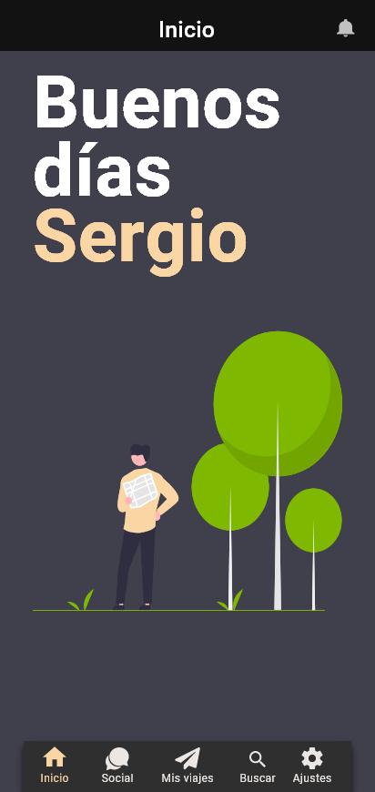

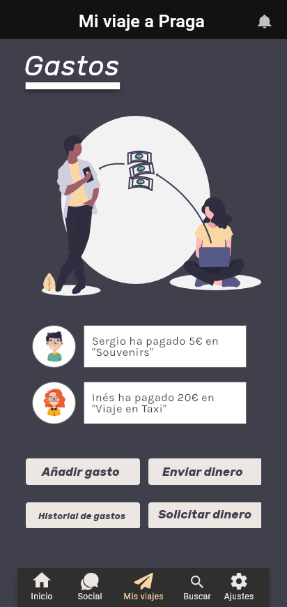
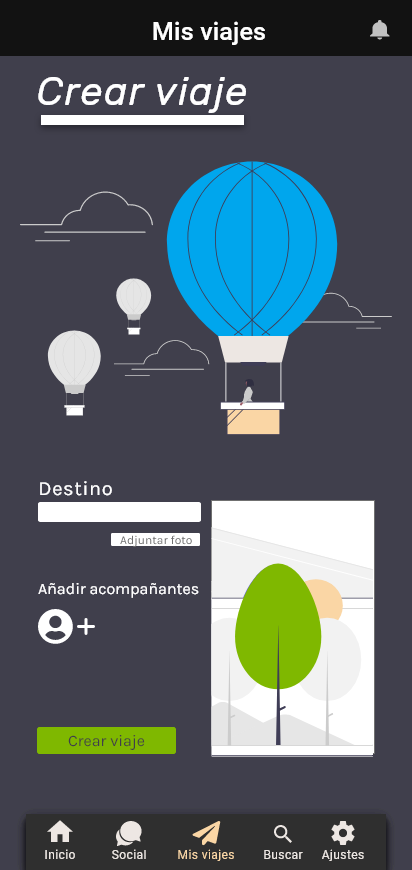
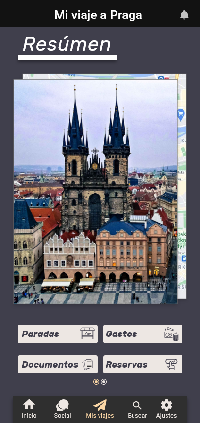
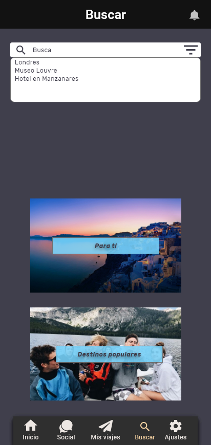
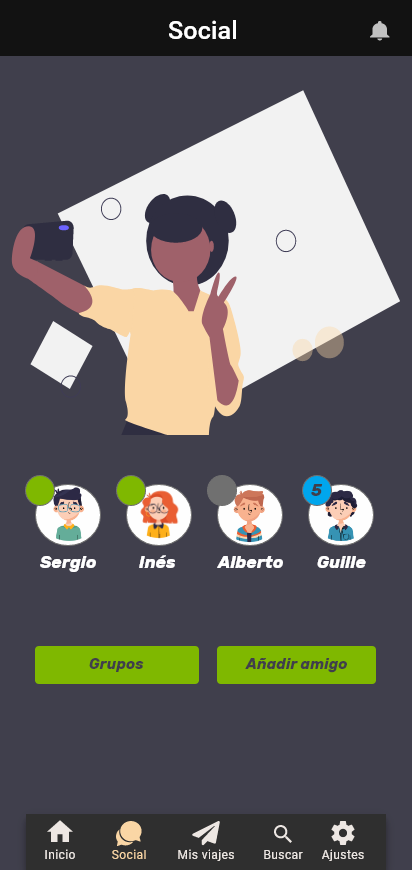

Para simular de forma más realista la navegación por la aplicación, hemos cargado el mockup de Adobe Xd en un dispositivo móvil real tras haber establecido todas las conexiones entre los distintos botones de la aplicación para que dirigieran a su lugar correspondiente. Esto también nos ayuda a comprobar que el diseño se adapta correctamente a distintos tamaños de pantalla ya que el diseño se realizó utilizando una plantilla del Pixel4 XL, el cual posee una resolución de 1440 x 3040 pixels y 6’3 pulgadas, y será probado a continuación en un Xiaomi MI8 con una resolución de 1080 x 2248 pixels y 6’2 pulgadas.

El prototipo en Adobe Xd quedaría así:
  

### Prueba en un dispositivo real
Haga click en la miniatura del vídeo para acceder a este:
  

## Documentación: Publicación del Case Study
Hemos publicado en Youtube un vídeo sobre nuestro Case Study, para acceder a este pulse [aquí](https://www.youtube.com/watch?v=_ayJhUkMq-k).

## Conclusión final
Esta práctica nos ha parecido muy interesante ya que durante su realización, nos hemos sentido realmente parte de un proceso de diseño real como sucedía en el ejemplo del UX Case Study de Muse Map. Además, hemos tenido la oportunidad de hacer uso de nuestra faceta creativa, utilizando herramientas que sin dudar usaremos en el futuro como adobe Xd o Milanote.

Principalmente valoramos el echo de haber aprendido todo el procedimiento previo a llegar a un Mockup Hi-Fi de la aplicación, lo cual nos ha permitido realizar unos diseños consistentes y más pulidos en general.

Por último, aunque en general nos ha resultado una muy buena experiencia, si que consideramos que la práctica podría realizarse mejor con algo más de tiempo ya que, debido a la carga de trabajo que presenta junto con la carga del resto de asignaturas, se nos ha complicado terminar todo a tiempo obteniendo un resultado con el que estuviéramos satisfechos.

 
