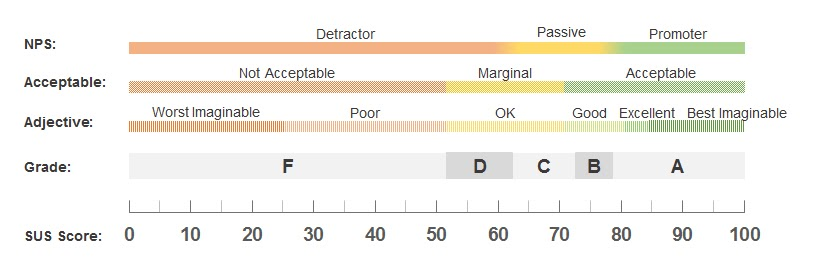

# DIU - Practica 4, entregables

## Resumen ejecutivo
Este estudio ha sido realizado por el equipo “DIU1-Aguacate”, formado por los integrantes:
Sergio García Cabrera: Alumno de la asignatura de DIU del grado de Ingeniería Informática en la UGR.
Inés Nieto Sánchez: Alumna de la asignatura de DIU del grado de Ingeniería Informática en la UGR.

Para la realización de este estudio se ha optado por utilizar a participantes reales creando una encuesta a través de Google Forms. La encuesta fue realizada el día 24 de mayo de 2021 en Granada y participaron 21 personas, de las cuales 10 fueron escogidas para realizar el informe. Cinco de estos participantes fueron destinados a evaluar el prototipo de la aplicación de Lolis y los otros cinco fueron destinados a evaluar el prototipo del grupo “El Reencuentro”.

Al inicio de la encuesta, se ha hecho uso de las imágenes de los dados aportadas en el guión de la práctica para que cada participante se categorice a sí mismo con respecto a la actividad que realizaban con más frecuencia y cómo se sentían actualmente. Con esto conseguimos perfilar con más detalle a la persona que está realizando el test, lo cual nos podría ayudar más adelante a buscar similitudes en los perfiles de los participantes ante determinados patrones de respuestas en los cuestionarios.

A continuación, le dábamos a elegir libremente el prototipo a evaluar al participante. Esto lo hicimos pensando que nos podría dar una buena indicación sobre cuál de los dos nombres de las aplicaciones llamaba más la atención del usuario. Los resultados fueron los siguientes:
El 52.4% escogió Lolis mientras que el 47.6% optó por EcoTravel.

Con este documento se evaluará la usabilidad cuantificando la accesibilidad, identidad, navegación y contenido de las dos aplicaciones mediante un A/B testing y un cuestionario SUS, y nos ayudará a conocer qué aspectos son mejorables en ambas en cuanto a complejidad y funcionalidad.

##Metodología
La encuesta en Google Forms creada por los profesores fue modificada para que el usuario participante categorizara su rol de forma similar a como se haría con los dados (actividad y emociones). Posteriormente se le da a elegir entre los dos prototipos para ser probados y se le pregunta su experiencia en Internet (‘Baja’, ‘Intermedia’ o ‘Avanzada’), así como las plataformas tecnológicas que más utiliza. 

Antes de realizar el test SUS, se le muestra al participante un vídeo con el prototipo correspondiente realizado en Adobe Xd para que este obtenga una visión general de la aplicación y a continuación, se le muestra el prototipo interactivo y se le pide que realice una serie de tareas.

Tras esto se les realiza finalmente las preguntas del cuestionario SUS.
El cuestionario SUS se forma de 10 preguntas valoradas del 1 al 5, donde 1 significa ‘Totalmente en desacuerdo’ y 5 ‘Totalmente de acuerdo’. Estas 10 preguntas son las siguientes:
Creo que me gustará visitar con frecuencia este website.
Encontré el website innecesariamente complejo.
Pensé que era fácil utilizar este website.
Creo que necesitaría del apoyo de un experto para recorrer el website.
Encontŕe las funciones del website bastante bien integradas.
Pensé que había demasiada inconsistencia en el website.
Imagino que la mayoría de las personas aprenderían muy rápidamente a utilizar el website.
Encontré website muy grande al recorrerlo.
Me sentí muy confiado en el manejo del website.
Necesito aprender muchas cosas antes de manejarme en el website.

Los usuarios que participaron en la encuesta fueron usuarios conocidos del equipo Aguacate y para obtener mayor número de participantes ésta fue publicada en RRSS, los cuales fueron informados sobre la temática de la encuesta antes de comenzarla.

El cálculo de la puntuación SUS se ha obtenido de la siguiente forma:
A las preguntas impares se le resta 1 a la puntuación dada por el usuario.
A las preguntas pares se calcula 5 menos la puntuación dada por el usuario.
Tras aplicar esos cálculos a cada pregunta, se suman los valores obtenidos por cada usuario y se multiplican los resultados por 2.5.

Para las calificaciones SUS se ha utilizado la clasificación de “Grade” que aparece en esta imagen:

## Caso 1: Lolis

### Descripción de la aplicación
**Lolis** es una aplicación de gestión y planificación de viajes que busca unificar todas las herramientas que un viajero pueda necesitar durante su viaje con el objetivo de mejorar su experiencia y facilitar todo el proceso del viaje desde el principio hasta el fin.

Las secciones principales que presenta la App de **Lolis** son las siguientes:
- **Inicio**: Pantalla de bienvenida.
- **Social**: Listado de amigos, grupos de amigos y chats.
- **Mis viajes**: Sección para acceder a la creación de un nuevo viaje a organizar o ver el listado de viajes ya creados.
- **Buscar**: Búsqueda de sitios de interés como hoteles, restaurantes, eventos culturales, etc. Desde esta sección es posible obtener recomendaciones de lugares a visitar y ver un listado de los destinos más populares.
- **Ajustes**: Configuración de la aplicación. Desde aquí será posible realizar cambios como el tema a utilizar por la app, unidad de medida/moneda o el idioma utilizado.

### Participantes  
Los usuarios que han participado para el test de Lolis son:
- Un estudiante de entre 15 y 30 años feliz, aficionado al deporte y con experiencia media en Internet que utiliza con frecuencia Windows,Mac/Linux y Android.

- Una estudiante de entre 15 y 30 años feliz, que pasa la mayoría de su tiempo procrastinando con experiencia avanzada en Internet que utiliza con frecuencia Windows, Mac/Linux, Android y una tablet.

- Un hombre pensionista de entre 45 y 60 años que se sentía enfadado, el cual pasa la mayoría de su tiempo procrastinando con un conocimiento en Internet bajo. Las plataformas tecnológicas más utilizadas por éste son Windows y Android.

- Una estudiante de entre 15 y 30 años que pasa la mayor parte de su tiempo trabajando y se siente disgustada. Posee un nivel medio de conocimientos de Internet y utiliza con más frecuencia Windows e IOS

- Una mujer entre 15 y 30 años sin ocupación aficionada a la fotografía que se sentía disgustada con un nivel medio de conocimientos de Internet que utiliza con mayor frecuencia Windows y Android.

| #id. usuario | Sexo/edad      | Ocupación   | Rol *Actividad a la que se dedica más tiempo  *Estado de ánimo | Experiencia internet | Plataforma                          | Prototipo elegido | SUS score |
|--------------|----------------|-------------|----------------------------------------------------------------|----------------------|-------------------------------------|-------------------|-----------|
|            1 | Hombre (15-30) | Estudiante  | ·Ejercicio  ·Feliz                                             | Intermedio           | Windows,Mac/Linux, Android          | Lolis             | A (80)    |
|            2 | Mujer (15-30)  | Estudiante  | ·Procrastinar ·Feliz                                           | Avanzado             | Windows, Mac/Linux, Android, Tablet | Lolis             | A (80)    |
|            3 | Hombre (45-60) | Pensionista | ·Procrastinar ·Enfadado                                        | Bajo                 | Windows,Android                     | Lolis             | F (40)    |
|            4 | Mujer (15-30)  | Estudiante  | ·Trabajar ·Disgustado                                          | Intermedio           | Windows/IOS                         | Lolis             | A (90)    |
|            5 | Mujer (15-30)  | Ninguna     | ·Fotografía ·Disgustado                                        | Intermedio           | Windows/Android                     | Lolis             | F (25)    |

### Evaluación de tareas/escenarios
Estas son las tareas que se ha pedido realizar a los participantes del estudio:
- **Crear un nuevo viaje/experiencia**. Consiste en identificar en el prototipo de la aplicación el icono para crear un nuevo viaje/experiencia.
- **Buscar alojamiento**. El usuario ha de buscar un alojamiento a través del icono de buscar y su barra de búsqueda.
- **Encontrar la página de inicio**. Tras haber navegado un poco por la aplicación el usuario ha de encontrar el icono perteneciente a la página de inicio de la aplicación.
- **Acceder a las notificaciones**. La sección de notificaciones no está presente en ninguno de los dos prototipos que estamos evaluando, así que consideraremos esta tarea como exitosa si el participante es capaz de identificar el icono de la campana asociado a las notificaciones de la aplicación.

| Participante Lolis  | Tarea 1 | Tarea 2 | Tarea 3 | Tarea 4 |
|---------------------|:-------:|:-------:|:-------:|:-------:|
|          1          |    √    |    √    |    √    |    √    |
|          2          |    √    |    √    |     √   |    √    |
|          3          |    -    |    -    |    √    |    √    |
|          4          |    √    |    √    |    √    |    √    |
|          5          |    -    |    √    |    √    |    -    |
|        Éxito        |     3   |    4    |    5    |    4    |
| Porcentaje de éxito |   60%   |   80%   |   100%  |   80%   |

### Cuestionario SUS
|    | PREGUNTAS                                                                                |  1 |  2 |  3 |  4 |  5 |
|----|------------------------------------------------------------------------------------------|:--:|:--:|:--:|:--:|:--:|
|  1 | Creo que me gustará visitar con frecuencia este website                                  |  4 |  3 |  3 |  5 |  3 |
|  2 | Encontré el website innecesariamente complejo                                            |  2 |  1 |  4 |  1 |  4 |
|  3 | Pensé que era fácil utilizar este website                                                |  5 |  5 |  3 |  5 |  2 |
|  4 | Creo que necesitaría del apoyo de un experto para recorrer el website                    |  1 |  1 |  5 |  1 |  5 |
|  5 | Encontré las funciones del website bastante bien integradas                              |  4 |  5 |  3 |  5 |  3 |
|  6 | Pensé que había demasiada inconsistencia en el website                                   |  2 |  1 |  3 |  1 |  4 |
|  7 | Imagino que la mayoría de las personas aprenderían muy rápidamente a utilizar el website |  5 |  4 |  4 |  5 |  3 |
|  8 | Encontré el website muy grande al recorrerlo                                             |  1 |  2 |  3 |  1 |  5 |
|  9 | Me sentí muy confiado en el manejo del website                                           |  5 |  5 |  3 |  5 |  2 |
| 10 | Necesito aprender muchas cosas antes de manejarme en el website                          |  1 |  1 |  5 |  1 |  5 |
|    |                                                             Valoración final (SUS Score) | 80 | 80 | 40 | 90 | 25 |

## Caso 2: EcoTravel

### Descripción de la aplicación
**EcoTravel** es una aplicación de gestión y planificación de viajes. Busca ofrecer una alternativa a aquellos viajeros que deseen estar más en contacto con la naturaleza, centrándose en ofrecer una experiencia de turismo rural y tradicional.
Su objetivo es facilitar al usuario la organización de viajes/experiencias.

Sus secciones principales son:
- **Home**: Página principal. Se muestran los lugares guardados por el usuario y los destinos destacados en la aplicación.
- **Buscar**: Pantalla de búsqueda. Permite buscar distintos destinos turísticos.
- **Añadir**: Pantalla para crear una nueva experiencia.
- **Ajustes**: Pantalla de configuración de la aplicación.
- **Perfil**: Información del usuario actual.

### Participantes
Los usuarios que han participado para el test de EcoTravel son:
- Un hombre de entre 30 y 45 años con ocupación como auxiliar que se siente feliz con un nivel avanzado en Internet que utiliza con mayor frecuencia Windows y Android.

- Un estudiante entre 15 y 30 años que se siente feliz el cual posee un nivel avanzado de conocimientos sobre Internet. Éste utiliza con mayor frecuencia Windows y Android.

- Un chico entre 15 y 30 años que trabaja como au pair y se encuentra triste. Posee un nivel avanzado de conocimientos en Internet y utiliza frecuentemente Windows, Android y una tablet.

- Un hombre que se encuentra triste de entre 30 y 45 años que trabaja, pero que invierte su tiempo mayoritariamente en procrastinar. Posee un conocimiento avanzado de Internet y utiliza frecuentemente Windows, Mac/Linux e IOS.

- Una mujer funcionaria de entre 45 y 60 años que trabaja y es feliz. Posee un nivel intermedio de conocimientos en Internet y utiliza frecuentemente Windows, Android y una tablet.

| #id. usuario | Sexo/edad      | Ocupación   | Rol *Actividad a la que se dedica más tiempo *Estado de ánimo | Experiencia internet | Plataforma              | Prototipo elegido | SUS score |
|--------------|----------------|-------------|---------------------------------------------------------------|----------------------|-------------------------|-------------------|-----------|
|       1      | Hombre (30-45) | Auxiliar    | ·Trabajar ·Feliz                                              | Avanzado             | Windows,Android         | EcoTravel         | F (42.5)  |
|       2      | Hombre (15-30) | Estudiante  | ·Trabajar ·Feliz                                              | Avanzado             | Windows/ Android        | Ecotravel         | B (77,5)  |
|       3      | Hombre (15-30) | Au pair     | ·Trabajar ·Triste                                             | Avanzado             | Windows,Android,Tablet  | EcoTravel         | C (67,5)  |
|       4      | Hombre (30-45) | Trabajando  | ·Procrastinar ·Triste                                         | Avanzado             | Windows/Mac/Linux/IOS   | Ecotravel         | B (72,5)  |
|       5      | Mujer (45-60)  | Funcionaria | ·Trabajar ·Feliz                                              | Intermedio           | Windows/Android/ Tablet | Ecotravel         | B (75)    |

### Evaluación de tareas/escenarios
Estas son las tareas que se ha pedido realizar a los participantes del estudio:
- **Crear un nuevo viaje/experiencia**. Consiste en identificar en el prototipo de la aplicación el icono para crear un nuevo viaje/experiencia.
- **Buscar alojamiento**. El usuario ha de buscar un alojamiento a través del icono de buscar y su barra de búsqueda.
- **Encontrar la página de inicio**. Tras haber navegado un poco por la aplicación el usuario ha de encontrar el icono perteneciente a la página de inicio de la aplicación.
- **Acceder a las notificaciones**. La sección de notificaciones no está presente en ninguno de los dos prototipos que estamos evaluando, así que consideraremos esta tarea como exitosa si el participante es capaz de identificar el icono de la campana asociado a las notificaciones de la aplicación.

| Participante EcoTravel | Tarea 1 | Tarea 2 | Tarea 3 | Tarea 4 |
|------------------------|:-------:|:-------:|:-------:|:-------:|
|            1           |    -    |    √    |    √    |    √    |
|            2           |    √    |    √    |    √    |    √    |
|            3           |    √    |    √    |    √    |    √    |
|            4           |    √    |    √    |    √    |    √    |
|            5           |    -    |    √    |    √    |    √    |
|          Éxito         |     3   |    5    |    5    |    5    |
|   Porcentaje de éxito  |   60%   |   100%  |   100%  |   100%  |

### Cuestionario SUS

|    | PREGUNTAS                                                                                |   6  |   7  |   8  |   9  | 10 |
|----|------------------------------------------------------------------------------------------|:----:|:----:|:----:|:----:|:--:|
|  1 | Creo que me gustará visitar con frecuencia este website                                  |   3  |   3  |   2  |   3  |  4 |
|  2 | Encontré el website innecesariamente complejo                                            |   4  |   2  |   1  |   2  |  2 |
|  3 | Pensé que era fácil utilizar este website                                                |   3  |   4  |   4  |   4  |  5 |
|  4 | Creo que necesitaría del apoyo de un experto para recorrer el website                    |   4  |   2  |   1  |   2  |  1 |
|  5 | Encontré las funciones del website bastante bien integradas                              |   4  |   4  |   3  |   3  |  3 |
|  6 | Pensé que había demasiada inconsistencia en el website                                   |   3  |   2  |   2  |   3  |  3 |
|  7 | Imagino que la mayoría de las personas aprenderían muy rápidamente a utilizar el website |   3  |   5  |   4  |   5  |  4 |
|  8 | Encontré el website muy grande al recorrerlo                                             |   4  |   1  |   3  |   3  |  2 |
|  9 | Me sentí muy confiado en el manejo del website                                           |   2  |   4  |   2  |   5  |  3 |
| 10 | Necesito aprender muchas cosas antes de manejarme en el website                          |   3  |   2  |   1  |   1  |  1 |
|    |                                                             Valoración final (SUS Score) | 42,5 | 77.5 | 67.5 | 72.5 | 75 |

## Conclusiones
En conclusión, podemos observar que las puntuaciones SUS obtenidas para la app de Ecotravel son en general más consistentes que las de Lolis. Buscando un posible motivo para esto, analizamos los perfiles de los participantes 3 y 5 para buscar similitudes que nos puedan aportar algo de información sobre la causa de sus discordantes resultados de los cuestionarios SUS, pero no encontramos nada relevante. Esto nos hace pensar que se puede deber al pequeño número de participantes del cuestionario y que con un mayor número de participantes, las puntuaciones serían más regulares. Por otro lado, valorando el resto de cuestionarios SUS y las tasas de éxito en las tareas encargadas, podemos ver como ambos prototipos consiguen unos muy buenos resultados.

De la aplicación de Ecotravel nos ha gustado la rapidez con la que es posible acceder a las distintas secciones gracias a su sencilla barra de navegación, aunque cabe destacar que alguno de los participantes del cuestionario se mostró confuso en un primer momento ante qué se añadía en el apartado con la etiqueta “Añadir”. 

Esto se podría solucionar cambiando dicha etiqueta a algo más descriptivo como “Nueva experiencia”.

Otro punto fuerte en términos de accesibilidad es el contraste principal Verde sobre fondo Blanco que utiliza, el cual, facilita bastante el visionado de contenido y la lectura en general.

Pasando a la app de Lolis, los participantes del cuestionario han podido identificar fácilmente las secciones de la app durante el uso del prototipo en la realización de las tareas aunque es necesario mencionar que el participante 3 ha mostrado dificultad para leer algunos de los botones de la aplicación que utilizan un color de texto gris sobre un fondo blanco. La causa de esto puede deberse principalmente al bajo contraste de los colores mencionados.

