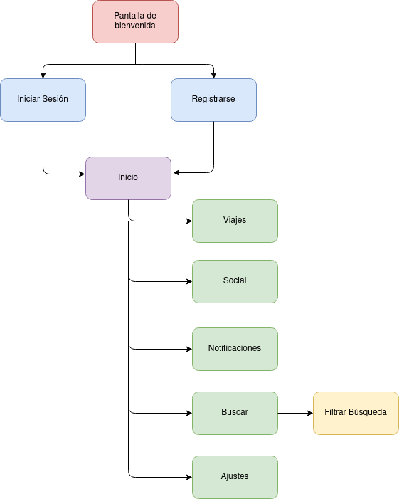

# DIU21
Prácticas Diseño Interfaces de Usuario 2020-21 (Tema: Turismo) 

Grupo: DIU1_Aguacate.  Curso: 2020/21 
Updated: 8/2/2021

Proyecto: 
>>> Lolis

Descripción: 

>>> Lolis se trata de una aplicación móvil que busca unificar todas las herramientas que un viajero puede necesitar para organizar su viaje, desde planificación
>>> de rutas, hasta reservas de alojamiento, junto con otras funcionalidades como gestión de documentos de viaje, gestión de gastos, etc.

Logotipo: 
>>> Opcionalmente si diseña un logotipo para su producto en la práctica 3 pongalo aqui

Miembros
 * :bust_in_silhouette:   Sergio García Cabrera     :octocat: [@Olasergiolas](https://github.com/Olasergiolas)    
 * :bust_in_silhouette:  Inés Nieto Sánchez     :octocat: [@ins426](https://github.com/ins426)

----- 

# Proceso de Diseño 

## Paso 1. UX Desk Research & Analisis 

 1.a Competitive Analysis
-----

>>> De entre todas las aplicaciones observadas, cuatro han sido seleccionadas para la realización del análisis competitivo: Lambus, Tripit, Sygic Travel y Polarsteps. De entre estas cinco, hemos elegido Lambus por sus buenas reviews en Google Play Store, además de su cuidada presentación en comparación con sus competidores seleccionados.

Para acceder al análisis competitivo al completo pulse [aquí](P1/README.md/#1-an%C3%A1lisis-de-competencia).

 1.b Persona
-----

>>> Para las personas a utilizar, hemos querido representar dos perfiles muy diferentes: [Isella](P1/README.md/#2-personas) y [Onesífero de los Ríos](P1/README.md/#2-personas).
>>> Hemos elegido a estas personas porque ambas presentan retos interesantes que muestran las dificultades a las que se
>>> podría enfrentar un usuario real.

 1.c User Journey Map
----

>>> Hemos querido representar el uso de la aplicación por parte de las dos personas diseñadas teniendo en cuenta el reto que cada una presenta.

Para ver el Journey Map de Isella y Onesífero pulse [aquí](P1/README.md/#3-journey-maps).

 1.d Usability Review
----

>>> - Enlace a la [sección](P1/README.md/#4-revisión-de-usabilidad).
>>> - Enlace al documento [aquí](P1/Usability-review-Lambus.pdf).
 >>> - Valoración final: 65
 >>> - Comentario sobre la valoración: En general, Lambus ha demostrado ser una app que mayormente cumple con la 
 >>> funcionalidad básica que puede esperar un viajero pero que se ve lastrada por el uso de unos menús poco 
 >>> señalizados por los que es fácil perderse.

## Paso 2. UX Design  

 2.a Empathy map
----

>>> Tras analizar otras aplicaciones similares, además de lo aprendido en la práctica anteior, hemos podido apreciar que muchas de estas aplicaciones pueden llegar a ser confusas y poco amigables de cara al usuario a la hora de utilizarlas, además de carecer de funcionalidad que debería de ser básica como la planificación por horas, por ello, respecto a la navegación por la aplicación, se intentará facilitar su uso mediante la utilización de una interfaz sencilla que utilice botones claramente etiquetados, que no abuse de submenús y que muestre un tour de la aplicación durante su primera ejecución.

Para acceder al empathy map obtenido a partir de la práctica anterior además de a la propuesta de valor final pulse [aquí.](P2/README.md/#ideación)

 2.b ScopeCanvas
----
Para acceder al Scope Canvas pulse [aquí.](P2/README.md/#propuesta-de-valor)

 2.b Tasks analysis 
-----

>>> Para identificar las tareas y su relevancia para nuestros usuarios, hemos decidido realizar una matriz de tareas/usuarios que nos permitirá segmentar la información relativa a cada tarea por las distintas etapas que presenta el proceso de realizar un viaje, desde la organización inicial hasta su fin. En definitiva, para nuestro caso consideramos que lo más apropiado era diferenciar entre distintos tipos de usuario en función a la etapa de uso en la que se encontraran de nuestra aplicación.

Para acceder a la matriz de tareas pulse [aquí.](P2/README.md/#task-analysis)

 2.c IA: Sitemap + Labelling 
----

Para acceder al Sitemap completo y al Labelling pulse [aquí.](P2/README.md/#arquitectura-de-información)

 2.d Wireframes
-----

>>> Para el prototipo de esta aplicación se ha utilizado Adobe Xd en conjunto con el UI Kit oficial de Android además del kit de Wireframes "FreeWire".

Para acceder al prototipo de la aplicación pulse [aquí.](P2/README.md/#prototipo-lo-fi-wireframe)

## Paso 3. Mi UX-Case Study (diseño)
>>> Para la realización de nuestra aplicación hemos analizado y comparado distintas apps de gestión de viajes, nos hemos preguntado cuáles son las necesidades principales en la planificación de un viaje y qué factores visuales hacen más atractiva a una aplicación de este tipo para el usuario. 

>>> Para la parte funcional hemos detallado las funcionalidades imprescindibles con las que tenía que contar nuestra aplicación. En cuanto al aspecto visual, nos hemos inspirado en los distintos tipos de destinos (tropicales, rurales, urbanos…) para la elección de una paleta de colores, hemos hecho uso de la psicología de tipografías, pensado en la accesibilidad para distintos tipos de usuarios y aplicado distintos patrones de interacción para conseguir una aplicación intuitiva, cómoda y cercana al usuario.

 3.a Moodboard
-----

>>> Para el moodboard buscábamos un diseño minimalista con frescura, para ello nos pusimos en la piel de un viajero preguntándos qué le podría llamar la atención de nuestra aplicación y de qué forma podríamos mostrarnos más cercanos al usuario.

Para acceder al moodboard de la aplicación pulse [aquí.](P3/README.md/#moodboard-dise%C3%B1o-visual--logotipo)

  3.b Landing Page
----

>>> Plantear Landing Page 

 3.c Guidelines
----

>>> Estudio de Guidelines y Patrones IU a usar 
>>> Tras documentarse, muestre las deciones tomadas sobre Patrones IU a usar para la fase siguiente de prototipado. 

  3.d Mockup
----

>>> Layout: Mockup / prototipo HTML  (que permita simular tareas con estilo de IU seleccionado)

 3.e ¿My UX-Case Study?
-----

>>> Publicar my Case Study en Github..
>>> Documente y resuma el diseño de su producto en forma de video de 90 segundos aprox

## Paso 4. Evaluación 

 4.a Caso asignado
----

>>> Breve descripción del caso asignado con enlace a  su repositorio Github

 4.b User Testing
----

>>> Seleccione 4 personas ficticias. Exprese las ideas de posibles situaciones conflictivas de esa persona en las propuestas evaluadas. Asigne dos a Caso A y 2 al caso B
 

| Usuarios | Sexo/Edad     | Ocupación   |  Exp.TIC    | Personalidad | Plataforma | TestA/B
| ------------- | -------- | ----------- | ----------- | -----------  | ---------- | ----
| User1's name  | H / 18   | Estudiante  | Media       | Introvertido | Web.       | A 
| User2's name  | H / 18   | Estudiante  | Media       | Timido       | Web        | A 
| User3's name  | M / 35   | Abogado     | Baja        | Emocional    | móvil      | B 
| User4's name  | H / 18   | Estudiante  | Media       | Racional     | Web        | B 

. 4.c Cuestionario SUS
----

>>> Usaremos el **Cuestionario SUS** para valorar la satisfacción de cada usuario con el diseño (A/B) realizado. Para ello usamos la [hoja de cálculo](https://github.com/mgea/DIU19/blob/master/Cuestionario%20SUS%20DIU.xlsx) para calcular resultados sigiendo las pautas para usar la escala SUS e interpretar los resultados
http://usabilitygeek.com/how-to-use-the-system-usability-scale-sus-to-evaluate-the-usability-of-your-website/)
Para más información, consultar aquí sobre la [metodología SUS](https://cui.unige.ch/isi/icle-wiki/_media/ipm:test-suschapt.pdf)

>>> Adjuntar captura de imagen con los resultados + Valoración personal 

 4.d Usability Report
----

>> Añadir report de usabilidad para práctica B (la de los compañeros)

>>> Valoración personal 

## Paso 5. Evaluación de Accesibilidad  

  5.a Accesibility evaluation Report 
----

>>> Indica qué pretendes evaluar (de accesibilidad) sobre qué APP y qué resultados has obtenido 

>>> 5.a) Evaluación de la Accesibilidad (con simuladores o verificación de WACG) 
>>> 5.b) Uso de simuladores de accesibilidad 

>>> (uso de tabla de datos, indicar herramientas usadas) 

>>> 5.c Breve resumen del estudio de accesibilidad (de práctica 1) y puntos fuertes y de mejora de los criterios de accesibilidad de tu diseño propuesto en Práctica 4.

## Conclusión final / Valoración de las prácticas

>>> (90-150 palabras) Opinión del proceso de desarrollo de diseño siguiendo metodología UX y valoración (positiva /negativa) de los resultados obtenidos  

