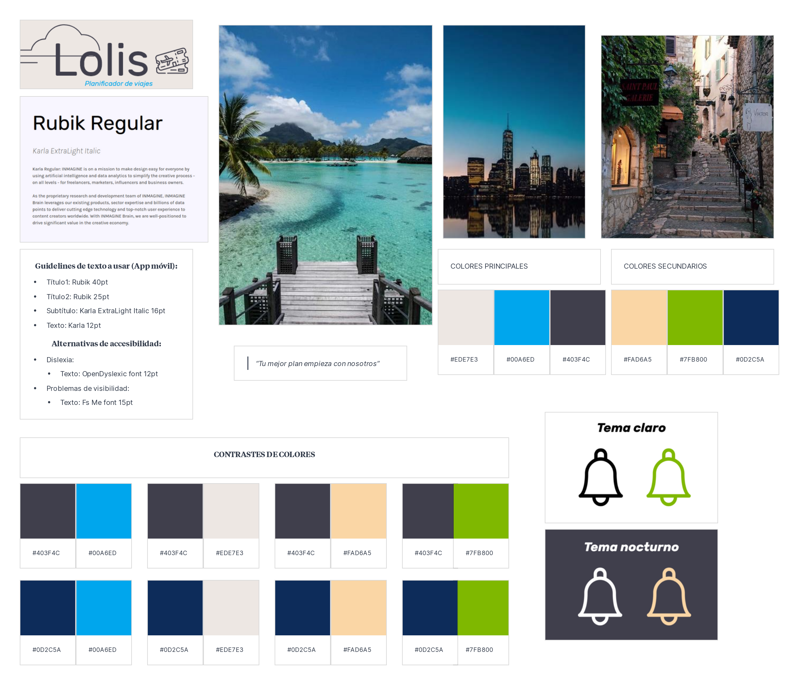

# DIU21
Prácticas Diseño Interfaces de Usuario 2020-21 (Tema: Turismo) 

Grupo: DIU1_Aguacate.  Curso: 2020/21 
Updated: 8/2/2021

Proyecto: 
Lolis

Descripción: Lolis se trata de una aplicación móvil que busca unificar todas las herramientas que un viajero puede necesitar para organizar su viaje, desde planificación de rutas, hasta reservas de alojamiento, junto con otras funcionalidades como gestión de documentos de viaje, gestión de gastos, etc.

Logotipo: 
  

Eslogan: **"Tu mejor plan empieza con nosotros"**

Miembros
 * :bust_in_silhouette:   Sergio García Cabrera     :octocat: [@Olasergiolas](https://github.com/Olasergiolas)    
 * :bust_in_silhouette:  Inés Nieto Sánchez     :octocat: [@ins426](https://github.com/ins426)

----- 

# Proceso de Diseño 

## Paso 1. UX Desk Research & Analisis 

 1.a Competitive Analysis
-----

De entre todas las aplicaciones observadas, cuatro han sido seleccionadas para la realización del análisis competitivo: Lambus, Tripit, Sygic Travel y Polarsteps. De entre estas cinco, hemos elegido Lambus por sus buenas reviews en Google Play Store, además de su cuidada presentación en comparación con sus competidores seleccionados.

Para acceder al análisis competitivo al completo pulse [aquí](P1/README.md/#1-an%C3%A1lisis-de-competencia).

 1.b Persona
-----

Para las personas a utilizar, hemos querido representar dos perfiles muy diferentes: [Isella](P1/README.md/#2-personas) y [Onesífero de los Ríos](P1/README.md/#2-personas).
Hemos elegido a estas personas porque ambas presentan retos interesantes que muestran las dificultades a las que se
podría enfrentar un usuario real.

 1.c User Journey Map
----

Hemos querido representar el uso de la aplicación por parte de las dos personas diseñadas teniendo en cuenta el reto que cada una presenta.

Para ver el Journey Map de Isella y Onesífero pulse [aquí](P1/README.md/#3-journey-maps).

 1.d Usability Review
----

- Enlace a la [sección](P1/README.md/#4-revisión-de-usabilidad).
- Enlace al documento [aquí](P1/Usability-review-Lambus.pdf).
- Valoración final: 65
- Comentario sobre la valoración: En general, Lambus ha demostrado ser una app que mayormente cumple con la 
funcionalidad básica que puede esperar un viajero pero que se ve lastrada por el uso de unos menús poco 
señalizados por los que es fácil perderse.

## Paso 2. UX Design  

 2.a Empathy map
----

Tras analizar otras aplicaciones similares, además de lo aprendido en la práctica anteior, hemos podido apreciar que muchas de estas aplicaciones pueden llegar a ser confusas y poco amigables de cara al usuario a la hora de utilizarlas, además de carecer de funcionalidad que debería de ser básica como la planificación por horas, por ello, respecto a la navegación por la aplicación, se intentará facilitar su uso mediante la utilización de una interfaz sencilla que utilice botones claramente etiquetados, que no abuse de submenús y que muestre un tour de la aplicación durante su primera ejecución.

Para acceder al empathy map obtenido a partir de la práctica anterior además de a la propuesta de valor final pulse [aquí.](P2/README.md/#ideación)

 2.b ScopeCanvas
----
Para acceder al Scope Canvas pulse [aquí.](P2/README.md/#propuesta-de-valor)

 2.b Tasks analysis 
-----

Para identificar las tareas y su relevancia para nuestros usuarios, hemos decidido realizar una matriz de tareas/usuarios que nos permitirá segmentar la información relativa a cada tarea por las distintas etapas que presenta el proceso de realizar un viaje, desde la organización inicial hasta su fin. En definitiva, para nuestro caso consideramos que lo más apropiado era diferenciar entre distintos tipos de usuario en función a la etapa de uso en la que se encontraran de nuestra aplicación.

Para acceder a la matriz de tareas pulse [aquí.](P2/README.md/#task-analysis)

 2.c IA: Sitemap + Labelling 
----

Para acceder al Sitemap completo y al Labelling pulse [aquí.](P2/README.md/#arquitectura-de-información)

 2.d Wireframes
-----

Para el prototipo de esta aplicación se ha utilizado Adobe Xd en conjunto con el UI Kit oficial de Android además del kit de Wireframes "FreeWire".

Para acceder al prototipo de la aplicación pulse [aquí.](P2/README.md/#prototipo-lo-fi-wireframe)

## Paso 3. Mi UX-Case Study (diseño)
Estábamos buscando una aplicación para organizar nuestro viaje de verano, pero tras probar algunas de las principales opciones disponibles en el Play Store, nos decepcionó, ninguna nos convenció completamente. Algunas eran confusas, mientras que a otras les faltaba funcionalidades o nos parecían poco seguras. Esto nos motivó a diseñar nuestra propia aplicación de planificación de viajes. Una aplicación cuyo principal objetivo es acompañar al usuario durante todas las etapas de su viaje, dándole todas las herramientas que pueda necesitar, de una forma personalizada gracias al aprendizaje de los gustos del usuario que realiza la aplicación mediante inteligencia artificial.

Podéis ver la historia completa del proceso de Case Study para nuestra aplicación "Lolis" en este [vídeo](https://www.youtube.com/watch?v=_ayJhUkMq-k)

 3.a Moodboard
-----

Para el moodboard buscábamos un diseño minimalista con frescura, para ello nos pusimos en la piel de un viajero preguntándos qué le podría llamar la atención de nuestra aplicación y de qué forma podríamos mostrarnos más cercanos al usuario. Durante el proceso quisimos inspirarnos con imágenes de algunos de los posibles destinos a los que podría viajar un usuario como son un pueblo, la playa o la ciudad. De estas imágenes obtuvimos una paleta de colores, buscamos estudios sobre psicología de tipografías, decidimos realizar un tema claro y nocturno buscando siempre esa sensación minimalista.

Para acceder al Moodboard de la aplicación pulse [aquí.](P3/readme.md/#moodboard-dise%C3%B1o-visual--logotipo)

  3.b Landing Page
----

Para su diseño nos ayudamos del moodboard, haciendo contrastes de colores y haciendo uso de las fuentes escogidas. Con la Landing Page queremos que con un vistazo rápido el usuario sepa de qué trata a grandes rasgos nuestra aplicación, informando a su vez qué nos hace diferentes y mejores de nuestros competidores para animar al usuario a descargar nuestra aplicación. 

Para acceder a la Landing Page pulse [aquí.](P3/readme.md/#landing-page)

 3.c Guidelines
----

Como Guidelines hemos hecho uso de las Material Design de Android aplicando algunos de los patrones de diseño vistos en clase.

Para acceder a las Guidelines pulse [aquí.](P3/readme.md/#guidelines)

  3.d Mockup
----

Hemos creado un Mockup usando la herramienta Adobe Xd basándonos en todos los apartados anteriores, así como en la práctica 2. Además, hemos grabado y subido a Youtube una simulación de cómo se vería nuestra aplicación en el móvil.

Para acceder al Mockup completo pulse [aquí.](P3/readme.md/#mockup-layout-hi-fi)

### Prueba en un dispositivo real
Haga click en la miniatura del vídeo para acceder a este:
  

 3.e ¿My UX-Case Study?
-----

A lo largo de la práctica hemos ido contando la historia de la realización de todo el proceso de diseño inspirándonos en el contenido del Case Study de la app de [Muse Map](https://blog.prototypr.io/musemap-street-art-app-ux-case-study-9bec6a99823b), pero también hemos realizado un vídeo en el que lo resumimos brevemente, para acceder a éste pulse [aquí](https://www.youtube.com/watch?v=_ayJhUkMq-k).

Para acceder al Case Study pulse [aquí.](P3/readme.md/#documentaci%C3%B3n-publicaci%C3%B3n-del-case-study)

## Paso 4. Evaluación 

 4.a Caso asignado
----
 
EcoTravel es una aplicación de gestión y planificación de viajes. Busca ofrecer una alternativa a aquellos viajeros que deseen estar más en contacto con la naturaleza, centrándose en ofrecer una experiencia de turismo rural y tradicional, facilitando al usuario la organización de este tipo de experiencias.
Podemos encontrar el repositorio de su proyecto [aquí](https://github.com/JesusGonzalezA/DIU21).

Las secciones principales de su aplicación son:
- Home: Página principal. Se muestran los lugares guardados por el usuario y los destinos destacados en la aplicación.
- Buscar: Pantalla de búsqueda. Permite buscar distintos destinos turísticos.
- Añadir: Pantalla para crear una nueva experiencia.
- Ajustes: Pantalla de configuración de la aplicación.
- Perfil:    Información del usuario actual.

 4.b User Testing
----
Para este práctica nos hemos ayudado de 10 personas reales que han accedido a participar en este estudio mediante la realización de una encuesta anónima en Google Forms. Estas personas son tanto conocidos nuestros como desconocidos de internet que realizaron el formulario tras publicarlo en RRSS.
 

| #id. usuario | Sexo/edad      | Ocupación   | Rol *Actividad a la que se dedica más tiempo *Estado de ánimo | Experiencia internet | Plataforma                          | Prototipo elegido | SUS score |
|--------------|----------------|-------------|---------------------------------------------------------------|----------------------|-------------------------------------|-------------------|-----------|
| 1            | Hombre (15-30) | Estudiante  | ·Ejercicio  ·Feliz                                            | Intermedio           | Windows,Mac/Linux, Android          | Lolis             | A (80)    |
| 2            | Mujer (15-30)  | Estudiante  | ·Procrastinar ·Feliz                                          | Avanzado             | Windows, Mac/Linux, Android, Tablet | Lolis             | A (80)    |
| 3            | Hombre (45-60) | Pensionista | ·Procrastinar ·Enfadado                                       | Bajo                 | Windows,Android                     | Lolis             | F (40)    |
| 4            | Mujer (15-30)  | Estudiante  | ·Trabajar ·Disgustado                                         | Intermedio           | Windows/IOS                         | Lolis             | A (90)    |
| 5            | Mujer (15-30)  | Ninguna     | ·Fotografía ·Disgustado                                       | Intermedio           | Windows/Android                     | Lolis             | F (25)    |
| 6 | Hombre (30-45) | Auxiliar    | ·Trabajar ·Feliz      | Avanzado   | Windows,Android         | EcoTravel | F (42.5) |
| 7 | Hombre (15-30) | Estudiante  | ·Trabajar ·Feliz      | Avanzado   | Windows/ Android        | Ecotravel | B (77,5) |
| 8 | Hombre (15-30) | Au pair     | ·Trabajar ·Triste     | Avanzado   | Windows,Android,Tablet  | EcoTravel | C (67,5) |
| 9 | Hombre (30-45) | Trabajando  | ·Procrastinar ·Triste | Avanzado   | Windows/Mac/Linux/IOS   | Ecotravel | B (72,5) |
| 10 | Mujer (45-60)  | Funcionaria | ·Trabajar ·Feliz      | Intermedio | Windows/Android/ Tablet | Ecotravel | B (75)   |

. 4.c Cuestionario SUS
----
Estos son los resultados del cuestionario SUS aplicado a nuestros participantes para el prototipo de "El Reencuentro":

|    | PREGUNTAS                                                                                |   1  |   2  |   3  |   4  | 5 |
|----|------------------------------------------------------------------------------------------|:----:|:----:|:----:|:----:|:--:|
|  1 | Creo que me gustará visitar con frecuencia este website                                  |   3  |   3  |   2  |   3  |  4 |
|  2 | Encontré el website innecesariamente complejo                                            |   4  |   2  |   1  |   2  |  2 |
|  3 | Pensé que era fácil utilizar este website                                                |   3  |   4  |   4  |   4  |  5 |
|  4 | Creo que necesitaría del apoyo de un experto para recorrer el website                    |   4  |   2  |   1  |   2  |  1 |
|  5 | Encontré las funciones del website bastante bien integradas                              |   4  |   4  |   3  |   3  |  3 |
|  6 | Pensé que había demasiada inconsistencia en el website                                   |   3  |   2  |   2  |   3  |  3 |
|  7 | Imagino que la mayoría de las personas aprenderían muy rápidamente a utilizar el website |   3  |   5  |   4  |   5  |  4 |
|  8 | Encontré el website muy grande al recorrerlo                                             |   4  |   1  |   3  |   3  |  2 |
|  9 | Me sentí muy confiado en el manejo del website                                           |   2  |   4  |   2  |   5  |  3 |
| 10 | Necesito aprender muchas cosas antes de manejarme en el website                          |   3  |   2  |   1  |   1  |  1 |
|    |                                                             Valoración final (SUS Score) | 42,5 | 77.5 | 67.5 | 72.5 | 75 |

Como podemos observar, "El Reencuentro" ha obtenido por lo general puntuaciones aceptables y bastante consistentes, aunque sorprende la puntuación obtenida por el usuario 1.

Para acceder al reporte completo pulse [aquí](P4)

 4.d Usability Report
----

Hemos dividido el Usability Report en dos PDF con el objetivo de separar los resultados obtenidos en el cuestionario SUS y la realización de las tareas por parte de los participantes.

Estos documentos pueden ser encontrados aquí:
- [Usability Report asignado: "El Reencuentro"](P4/P4_UsabReport_Reencuentro_doneby_Aguacate_P4.pdf)
- [Usability Report propio: "Lolis"](P4/DIU1_Aguacate_P4.pdf)

En conclusión, podemos observar que las puntuaciones SUS obtenidas para la app de Ecotravel son en general más consistentes que las de Lolis. Buscando un posible motivo para esto, analizamos los perfiles de los participantes 3 y 5 para buscar similitudes que nos puedan aportar algo de información sobre la causa de sus discordantes resultados de los cuestionarios SUS, pero no encontramos nada relevante. Esto nos hace pensar que se puede deber al pequeño número de participantes del cuestionario y que con un mayor número de participantes, las puntuaciones serían más regulares. Por otro lado, valorando el resto de cuestionarios SUS y las tasas de éxito en las tareas encargadas, podemos ver como ambos prototipos consiguen unos muy buenos resultados.

Puede acceder a la conclusión completa [aquí](P4/readme.md/#conclusiones).

## Paso 5. Evaluación de Accesibilidad  

  5.a Accesibility evaluation Report 
----

>>> Indica qué pretendes evaluar (de accesibilidad) sobre qué APP y qué resultados has obtenido 

>>> 5.a) Evaluación de la Accesibilidad (con simuladores o verificación de WACG) 
>>> 5.b) Uso de simuladores de accesibilidad 

>>> (uso de tabla de datos, indicar herramientas usadas) 

>>> 5.c Breve resumen del estudio de accesibilidad (de práctica 1) y puntos fuertes y de mejora de los criterios de accesibilidad de tu diseño propuesto en Práctica 4.

## Conclusión final / Valoración de las prácticas

>>> (90-150 palabras) Opinión del proceso de desarrollo de diseño siguiendo metodología UX y valoración (positiva /negativa) de los resultados obtenidos  

